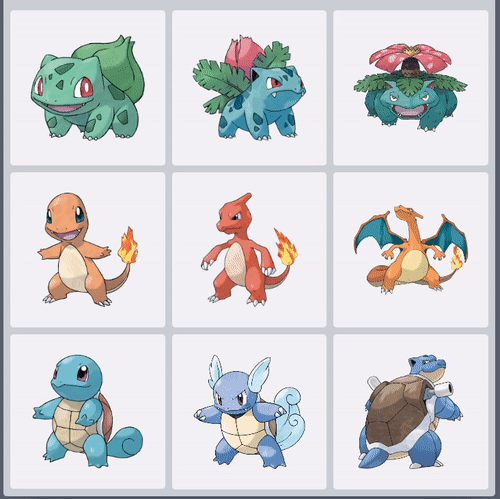

# Svelte Animation Example

This repo contains a small animation sample using [Svelte](https://svelte.dev/) (on top of [SvelteKit](https://kit.svelte.dev/)). All of the significant transitions/animations are built with built-in Svelte tools and run _smooth as hell_.

<p align="center">
  
</p>

## Animation Details

### Filter Animations

First up, animation for the filter "pills".

<p align="center">
  
</p>

Check out [the `filters.svelte` component](./src/components/filters.svelte) for implementation.

#### Crossfading

The transition of pills from "available" to "active" effectively boils down to creating a crossfade send/receive pair (provided by Svelte!):

```sveltehtml
<script lang="ts">
  import {crossfade} from "svelte/transition";
  import {slide} from 'svelte/transition';

  const [send, receive] = crossfade({
    duration: 300,
    fallback: slide
  });
</script>
```

and then applying these crossfade animations to the entering/exiting elements, sort of like:

```sveltehtml
{#if $inactiveTags.length}
  <div class="flex gap-2" transition:fadeSlide={{ duration: 300 }}>
    {#each $inactiveTags as tag (tag)}
      <button
        in:receive={{key: tag}}
        out:send={{key: tag}}
        on:click={() => activeTags.addTag(tag)}
        animate:flip={{duration: 300}}
        class="px-5 w-24 py-1 bg-white rounded-full text-xs"
      >{tag}</button>
    {/each}
  </div>
{/if}
```

The crossfade animations are applied via the `in:receive` and `out:send` directives! Ezpz, just need to specify a `key` for each element so Svelte knows where to crossfade elements to/from.

#### Collapsing the sections

The "active" and "available" filter sections will smoothly collapse/expand based on whether or not they have elements in them. That is handled via the `transition:fadeSlide={{ duration: 300 }}` bit above, where `fadeSlide` comes from a [custom `fadeSlide` transition](./src/utils/fadeSlide.ts). This just animates section's height/opacity to provide a collapsing/expanding effect.

### Item Grid Ordering

Next up, the grid reordering.

<p align="center">
	
</p>

You can check the source in [the `item-grid.svelte` component](./src/components/item-grid.svelte). This is really gets me fired up: all that's needed for this animation to work is incorporated into the markup below.

```sveltehtml
<div class="flex-1 overflow-y-auto">
  <div class="grid grid-cols-3 gap-2 p-2 aspect-square">
    {#each $availableItems as item (item.id)}
      <div
        class="p-6 bg-gray-100 rounded cursor-pointer aspect-square hover:shadow-lg transition-shadow duration-300"
        animate:flip={{duration:d => 30 * Math.sqrt(d)}}
        on:click={() => $activeItem = item}
        transition:fade
      >
        {#if $activeItem?.id !== item.id}
          
        {/if}
      </div>
    {/each}
  </div>
</div>
```

There's a fair bit of markup there, but the Svelte magic that handles the reordering animation is `animate:flip={{duration:d => 30 * Math.sqrt(d)}}`. The `animate:flip` directive uses [the FLIP technique](https://css-tricks.com/animating-layouts-with-the-flip-technique/) to animate the elements between their starting and ending positions. It's sort of... magical.

You might also notice there's a small fading effect when an item card is added or removed from the grid. Again, Svelte makes that magically simple. Just throw the `transition:fade` on the `div`s that are appearing/disappearing.

### Item Selection/Expansion

And finally, the item selection.

<p align="center">
	
</p>

This one is a _bit_ trickier, but _not much_. There's a crossfade animation between [the item grid](./src/components/item-grid.svelte) and [the active item overlay](./src/components/active-item.svelte).

Since there is a crossfade that is shared between two separate components, we can pull the crossfade definition out and into [a shared `selectedItemCrossfade.ts`](./src/utils/selectedItemCrossfade.ts) file, which is then imported into the two separate components.

In [the `item-grid.svelte` component](./src/components/item-grid.svelte), we use `in:receive` and `out:send` directives to use our shared crossfade `send` and `receive` methods:

```sveltehtml
<!-- ... -->

<!-- ... -->
```

And in [the `active-item.svelte` component](./src/components/active-item.svelte) we have a similar setup:

```sveltehtml
<!-- ... -->

<!-- ... -->
```

The matching keys between `in:receive` and `out:send` is basically all Svelte needs to make the crossfade magic happen.
