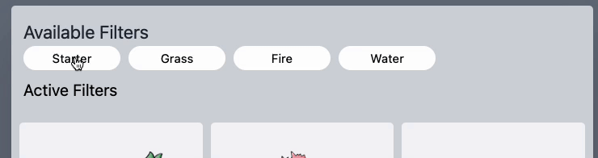

# Svelte Animation Example

This repo contains a small animation sample using [Svelte](https://svelte.dev/) (on top of [SvelteKit](https://kit.svelte.dev/)). All of the significant transitions/animations are built with built-in Svelte tools and run _smooth as hell_.

<p align="center">
  
</p>

## Animation Details

### Filter Animations

First up, animation for the filter "pills".

<p align="center">
  
</p>

Check out [the `filters.svelte` component](./src/components/filters.svelte) for implementation.

The transition of pills from "available" to "active" effectively boils down to creating a crossfade send/receive pair (provided by Svelte!):

```sveltehtml
<script lang="ts">
  import {crossfade} from "svelte/transition";
  import {slide} from 'svelte/transition';

  const [send, receive] = crossfade({
    duration: 300,
    fallback: slide
  });
</script>
```

and then applying these crossfade animations to the entering/exiting elements, sort of like:

```sveltehtml
{#if $inactiveTags.length}
  <div class="flex gap-2" transition:fadeSlide={{ duration: 300 }}>
    {#each $inactiveTags as tag (tag)}
      <button
        in:receive={{key: tag}}
        out:send={{key: tag}}
        on:click={() => activeTags.addTag(tag)}
        animate:flip={{duration: 300}}
        class="px-5 w-24 py-1 bg-white rounded-full text-xs"
      >{tag}</button>
    {/each}
  </div>
{/if}
```

The crossfade animations are applied via the `in:receive` and `out:send` directives! Ezpz, just need to specify a `key` for each element so Svelte knows where to crossfade elements to/from.
